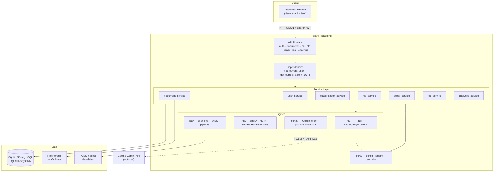
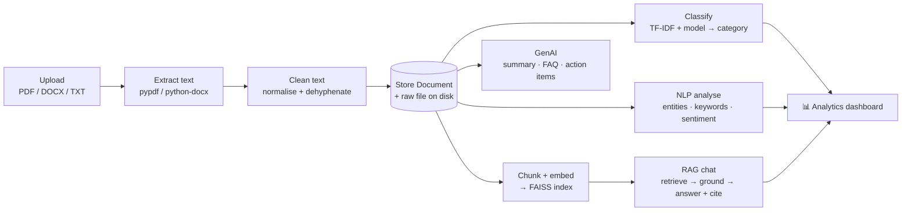
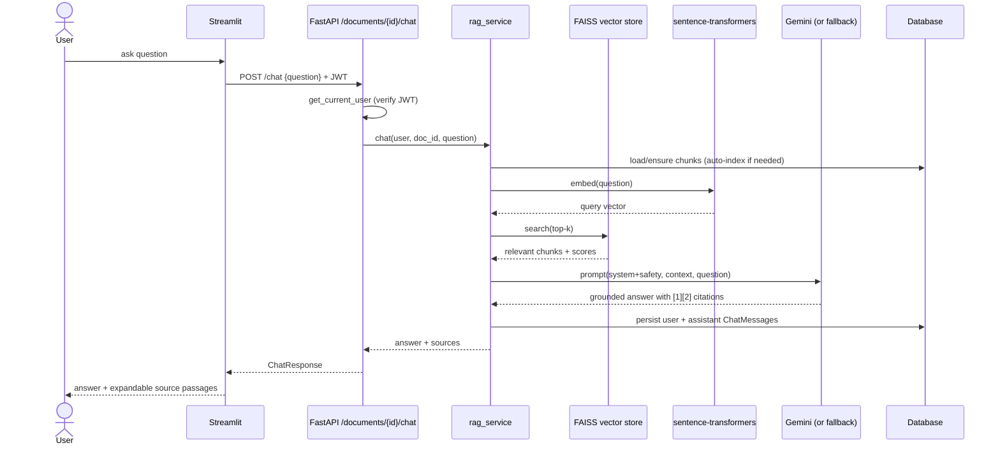
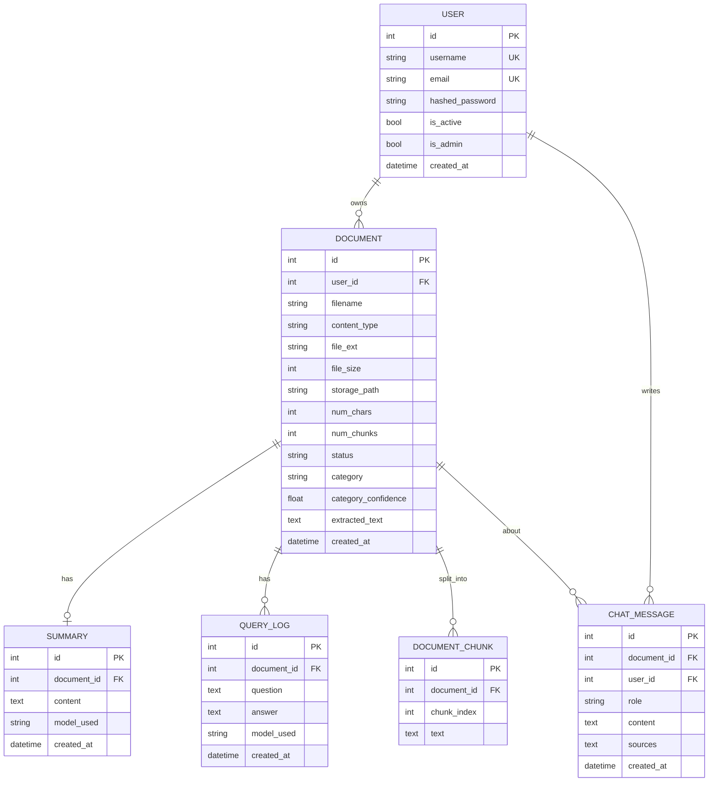

# Diagrams

All diagrams use [Mermaid](https://mermaid.js.org/) and render natively on GitHub.

---

## 1. Architecture Diagram (component view)

---

## 2. Data Flow Diagram (document → insight)

---

## 3. Sequence Diagram (RAG chat request)

---

## 4. ER Diagram (database schema)

